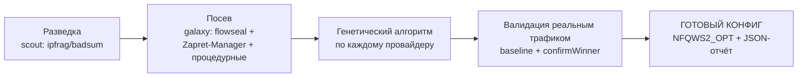

# prikop

**Автопоиск рабочих стратегий обхода DPI для [zapret2](https://github.com/bol-van/zapret2) / `nfqws2`.**

`prikop` — это движок, который **сам находит** рабочую `nfqws2`-стратегию под твой провайдер и твои заблокированные ресурсы: он гоняет сотни стратегий генетическим алгоритмом в изолированных Docker-воркерах против **реальных** целей (discord, youtube, пакетные зеркала, диапазоны хостеров), эволюционирует их, **валидирует реальным трафиком** и на выходе печатает готовый кусок конфига `NFQWS2_OPT`, который можно вставить в zapret2.

Никакого ручного перебора «а попробуй split2 pos=1, а теперь fake+badsum» — ты запускаешь одну команду и получаешь стратегию, которая **доказанно** пробивает DPI именно на твоём канале.

> Если тебе нужна теория «почему это вообще работает» — см. [`docs/dpi-bypass-knowledge.md`](docs/dpi-bypass-knowledge.md). Как устроен движок внутри — [`docs/architecture.md`](docs/architecture.md).

---

## Как это работает (в двух словах)



1. **Разведка** — короткие пробы (`ipfrag`, `fake+badsum`), чтобы понять, что вообще берёт этот DPI.
2. **Посев** — стартовая популяция стратегий из известных рабочих рецептов (flowseal, Zapret-Manager) + процедурно-сгенерированные.
3. **Эволюция** — по каждой цели крутится GA: пул из ≤50 Docker-воркеров параллельно прогоняет стратегии, каждая оценивается по реальному результату, лучшие скрещиваются/мутируют, поколение за поколением.
4. **Валидация** — перед эволюцией снимается **baseline без десинка** (вдруг цель и так открыта), а победитель **перепроверяется несколько раз** (`confirmWinner`), чтобы отсеять случайные проходы против вероятностного DPI.
5. **Вывод** — одинаковые стратегии по разным целям объединяются, печатается финальный конфиг (+ опционально JSON-отчёт по каждому поколению).

Каждый воркер поднимает `nfqws2` + `iptables NFQUEUE` внутри контейнера и реально ходит на целевые адреса — то есть тестируется **настоящий сетевой путь через твой DPI**, а не эмуляция.

---

## Требования

- **Linux** (нужны `NFQUEUE` + `iptables` внутри контейнеров).
- **Docker** с доступом к `/var/run/docker.sock` (prikop сам поднимает воркеры-контейнеры).
- **~3–4 ГБ свободной RAM** — до 50 воркеров по 60 МБ + оверхед.
- **[Nix](https://nixos.org/download)** (для `make`, который дергает тулчейн через `nix-shell`) — **или** Go 1.26, если собираешь без nix.
- Прямой (не через уже включённый zapret!) сетевой путь до целей — иначе двойной десинк исказит результат. Тестируй с машины/VM, где роутерный zapret **не** применяется к её трафику.

---

## Быстрый старт

```bash
# 1. Собрать образ (внутри: сборка nfqws2 из zapret2 + статический бинарь prikop + go generate)
make build

# 2. Прогнать ВСЕ провайдеры (долго — много целей × поколения)
make run

# 3. Или точечно — только нужные цели (быстрее)
make run PROVIDER=discord_web
make run PROVIDER=discord_web,discord_gateway,google_tcp
```

В конце прогона в stdout появится:

```
>>> 🎉 FINAL CONFIGURATION

# 1: discord_web
--hostlist-domains=discord.com
--payload=tls_client_hello --lua-desync=fake:blob=blob_stun:badsum:tcp_seq=-10000:repeats=8 --lua-desync=multisplit:pos=1:seqovl=654
--new
# 2: google_tcp
--filter-tcp=80,443 --hostlist=/app/targets/google.txt
--payload=tls_client_hello --lua-desync=multisplit:pos=1,midsld
```

Каждый блок (между `--new`) — готовая секция для `NFQWS2_OPT`: сверху фильтры, снизу стратегия. Одинаковые стратегии по разным целям объединяются в один блок.

---

## Что можно искать (провайдеры)

`-provider` (или `make run PROVIDER=...`) выбирает набор целей, comma-separated. **Без флага — прогоняются все.**

### Прикладные цели (`availability`)

| Провайдер | Что проверяет | Прото | Особенность |
|---|---|---|---|
| `discord_web` | discord.com + `/api/v9/gateway` | TCP | handshake-only (сайт/клиент должен открыться) |
| `discord_gateway` | gateway.discord.gg | TCP | handshake-only |
| `discord_cdn` | cdn.discordapp.com | TCP | handshake-only |
| `discord_media` | discord.media | TCP | handshake-only |
| `discord_voice` | голос Discord | — | **на хосте**, sniff живого звонка (см. ниже) |
| `google_tcp` | youtube + googlevideo rr1-эджи | TCP | реальная доставка видео |
| `google_udp` | googlevideo по QUIC | UDP/QUIC | HTTP/3 |
| `nixos_cache` | cache.nixos.org (реальный nar) | TCP | **download-check** (тело должно доехать) |
| `chaotic_cache` | garudalinux.org / chaotic.cx (repo db) | TCP | **download-check** |

### Диапазоны хостеров (`tcp16_20`) — DPI-детектор «16–20 пакетов»

Проверяют, режет ли DPI IP-диапазоны конкретного хостинга. 23 набора (сгенерированы из ASN → CIDR-ipset):

```
akamai  aws  cdn77  cloudflare  clouvider  contabo  creanova  digitalocean
fastly  fornex  frantech  gcore  googlecloud  hetzner  iomart  m247  melbicom
oracle  ovh  scalaxy  scaleway  vultr  zenlayer
```

Пример: `make run PROVIDER=hetzner,contabo` — найти стратегию для VPS в этих сетях.

---

## Флаги и переменные

### Флаги бинаря (`prikop`)

| Флаг | По умолчанию | Назначение |
|---|---|---|
| `-provider a,b,c` | *(все)* | прогнать только указанные провайдеры |
| `-seed N` | `0` (время) | **детерминированный** посев RNG эволюции — воспроизводимый прогон |
| `-report path.json` | *(нет)* | писать пофазовый JSON-отчёт GA |
| `-fake-path dir` | `/app/fake` | папка с fake-blob'ами (`*.bin`) |
| `-worker-socket path` | — | *(внутренний)* режим воркера; ставится пулом сам |

### Переменные Makefile

| Переменная | По умолчанию | Назначение |
|---|---|---|
| `PROVIDER` | *(пусто)* | пробрасывается в `-provider` |
| `HOST_SOCKET_DIR` | `/tmp/prikop_sockets` | сокеты воркеров (host↔контейнеры) |
| `HOST_TARGETS_DIR` | `./targets` | CIDR-ipset'ы и hostlist'ы, монтируются в воркеры |

Пример воспроизводимого прогона с отчётом:
```bash
docker run --rm -it \
  -v /var/run/docker.sock:/var/run/docker.sock \
  -v /tmp/prikop_sockets:/var/run/prikop \
  -v $PWD/targets:/app/targets \
  -v $PWD/fake:/app/fake \
  -e HOST_SOCKET_DIR=/tmp/prikop_sockets -e HOST_TARGETS_DIR=$PWD/targets \
  prikop:latest -provider discord_web -seed 42 -report /app/targets/run.json
# отчёт окажется в ./targets/run.json
```

---

## Как применить результат в zapret2

Финальный вывод — это уже `nfqws2`-синтаксис. Собери из блоков `NFQWS2_OPT`, разделяя секции `--new`:

```sh
# /opt/zapret2/config
NFQWS2_OPT="
--filter-tcp=443 --filter-l7=tls --hostlist-domains=discord.com
  --payload=tls_client_hello
  --lua-desync=fake:blob=blob_stun:badsum:tcp_seq=-10000:repeats=8
  --lua-desync=multisplit:pos=1:seqovl=654
--new
  ...следующая секция...
"
```
Затем `/etc/init.d/zapret2 restart` (или как перезапускается сервис в твоей установке). Подробнее про синтаксис, blob'ы, предпосылки (`nf_conntrack_checksum=0`, flow offloading, QUIC) — в [`docs/dpi-bypass-knowledge.md`](docs/dpi-bypass-knowledge.md).

---

## JSON-отчёт (`-report`)

```jsonc
{
  "generated_at": "2026-07-12T16:00:00+03:00",
  "providers": [
    {
      "provider": "discord_web",
      "proto": "tcp",
      "filters": "--hostlist-domains=discord.com",
      "outcome": "winner",              // winner | reachable_without_bypass | no_strategy
      "winner": "--payload=tls_client_hello --lua-desync=...",
      "generations": [
        { "gen": 0, "population": 100, "best_strategy": "...",
          "best_score": 42.0, "best_success": 2, "best_total": 2 }
      ]
    }
  ]
}
```
- `reachable_without_bypass` — цель открыта и без десинка (стратегия не нужна).
- `no_strategy` — за отведённые поколения рабочей не нашлось (цель IP-заблокирована, либо нужен другой посев/больше поколений).

---

## Проверка голоса Discord

Голос нельзя проверить активной пробой (Discord ввёл **DAVE** — E2EE), поэтому голос верифицируется **пассивным перехватом живого звонка** на хосте:

```bash
make voice-test          # соберёт бинарь, попросит sudo (нужен tcpdump)
# >>> зайди в голосовой канал Discord и ГОВОРИ ~20 секунд, пока идёт захват
```
Это работает вне Docker и вне GA — просто смотрит, проходит ли voice-UDP через твой DPI-путь.

---

## Добавить свою цель / провайдера

**Прикладную цель** — зарегистрируй провайдер в `internal/verifier/availability/*.go`:
```go
func init() {
    registerProvider(types.ProviderDefinition{
        Name:             "my_site",
        Gens:             3,
        Proto:            "tcp",
        SuccessThreshold: 1.0,
        Filters:          "--filter-tcp=443 --hostlist-domains=example.com",
        Targets: []types.Target{
            {URL: "https://example.com", IgnoreStatus: true, HandshakeOnly: true, Proto: types.ProtoTCP},
        },
    })
}
```
Полезные поля `Target`: `HandshakeOnly` (сайт открывается), `DownloadCheck` (тело большого файла должно доехать — ловит троттлинг), `NoRedirect`, `Threshold`/`MinSpeed`, `SNI`. См. [`docs/architecture.md`](docs/architecture.md).

**Диапазон хостера** (`tcp16_20`) — регенерируется из suite-JSON: `make generate` (тянет ASN→CIDR и переписывает `suite_v1_generated.go` + `targets/<slug>-cidr.txt`).

---

## Траблшутинг

| Симптом | Причина / решение |
|---|---|
| `Error creating docker client` | нет доступа к `/var/run/docker.sock` (права/группа `docker`) |
| `Startup validation failed ... not in CIDR range` | цель провайдера вне своего `CIDRFile` — обнови ipset (`make generate`) или поправь цель |
| воркеры падают, `already in use` | штатная гонка AutoRemove — пул сам ретраит; если массово — мало RAM (снизь нагрузку/`MaxWorkers`) |
| `no_strategy` у всех целей | цель **IP-заблокирована** (нужен VPN, не десинк) или ты тестируешь через уже включённый zapret (двойной десинк); проверь baseline в логах |
| «нашёл, а на роутере не работает» | предпосылки роутера: `nf_conntrack_checksum=0` для `badsum`, flow offloading, QUIC-путь браузера — см. `docs/dpi-bypass-knowledge.md` |
| висит на одном провайдере | это норм: `nixos_cache`/`chaotic_cache` качают реальные файлы (download-check медленный) |

---

## Документация

- [`docs/architecture.md`](docs/architecture.md) — как устроен движок внутри (пайплайн, компоненты, геном стратегии, как расширять).
- [`docs/dpi-bypass-knowledge.md`](docs/dpi-bypass-knowledge.md) — практические знания по пробитию DPI (механизмы, v1→v2 синтаксис, QUIC, деплой на роутер).
- [`docs/Strategies.md`](docs/Strategies.md), [`docs/flowseal.md`](docs/flowseal.md) — референс стратегий/рецептов.

---

## Лицензия / назначение

Инструмент для **личного** исследования обхода DPI на собственном канале. Тесты ходят на реальные эндпоинты (генерируют трафик) — используй ответственно.
