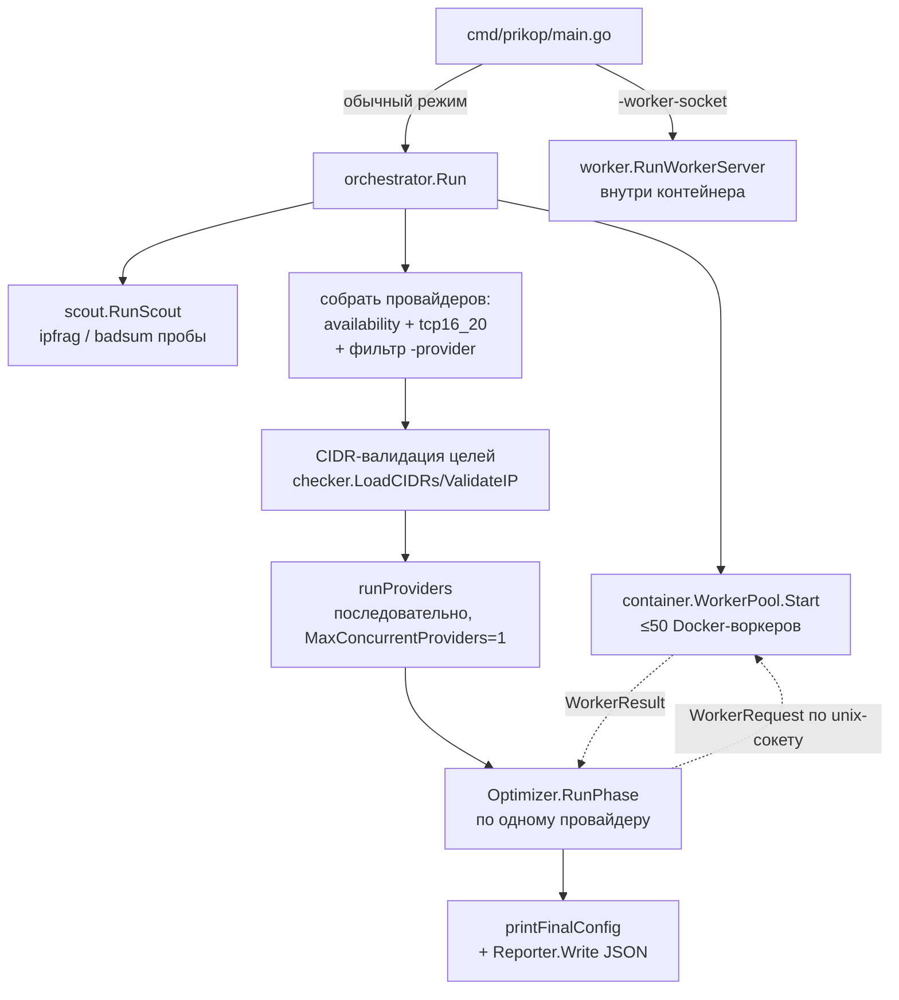
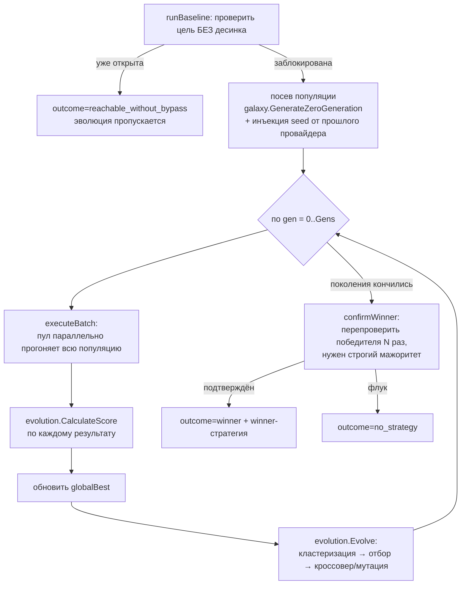

# Архитектура prikop

Как движок находит рабочую `nfqws2`-стратегию: пайплайн, компоненты, геном стратегии, точки расширения. Всё привязано к реальным файлам в репозитории.

---

## Пайплайн целиком



Два режима одного бинаря (`cmd/prikop/main.go`):
- **оркестратор** (по умолчанию) — управляет всем поиском;
- **воркер-сервер** (`-worker-socket <path>`) — то, что запускается *внутри* каждого контейнера-воркера; пул ставит этот флаг сам.

---

## Компоненты

| Пакет / файл | Роль |
|---|---|
| `cmd/prikop` | точка входа, разбор флагов, выбор режима |
| `cmd/generate-tcp16_20` | кодоген: suite-JSON (ASN) → `tcp16_20/suite_v1_generated.go` + `targets/<slug>-cidr.txt` |
| `internal/orchestrator/runner.go` | `Run`, `runProviders`, слияние/печать финального конфига (`optimizeStrategies`, `printFinalConfig`), голосовой перехват |
| `internal/orchestrator/optimizer.go` | `RunPhase` (GA по одной цели), `runBaseline`, `confirmWinner`, `executeBatch` |
| `internal/orchestrator/report.go` | `Reporter` — nil-safe накопитель JSON-отчёта (per-generation + per-provider) |
| `internal/container/pool.go` | `WorkerPool`: спавн/респавн Docker-воркеров, RPC `Exec` по unix-сокету |
| `internal/worker/worker.go` | `RunWorkerServer`, `executeTest`, `runChecks` |
| `internal/worker/ops.go` | `SetupIptables` (NFQUEUE), `StartNFQWS` (запуск `nfqws2`), `Cleanup` |
| `internal/scout/scout.go` | активная разведка DPI → `ReconReport` |
| `internal/galaxy/sniper.go` | посев нулевого поколения (импорт рецептов + процедурные) |
| `internal/evolution/*` | GA: `Evolve`, `CalculateScore`, `Mutator` (+ `_operators`/`_sanitize`/`_helpers`), `rng` |
| `internal/nfqws2/grammar.go` | **геном** стратегии (`Strategy`/`Action`/`Filter`) → `ToArgs` |
| `internal/verifier/availability/*` | определения прикладных провайдеров (`registerProvider`) |
| `internal/verifier/tcp16_20/*` | сгенерированный набор диапазонов хостеров (`Cases()`) |
| `internal/verifier/checker/*` | реальные проверки (HEAD / POST 64KiB / download / QUIC / STUN), CIDR-валидация, классификация ошибок |
| `internal/verifier/types/types.go` | `ProviderDefinition`, `Target`, `Protocol`, `CheckResult` |
| `internal/voicecap` | пассивный перехват голоса Discord (DAVE) |
| `internal/model/types.go` | константы + `WorkerRequest`/`WorkerResult`/`ScoredStrategy`/`ReconReport`/`FailureReason` |

---

## Жизненный цикл одного провайдера (`Optimizer.RunPhase`)



Ключевые моменты:
- **baseline-гейт** (`runBaseline`) отправляет `WorkerRequest{Baseline:true}` — воркер меряет цель **как есть**, без `iptables`/`nfqws`. Если и так открыто → эволюцию не запускаем (стратегия только навредила бы).
- **seed между провайдерами** — победитель одного провайдера инъектируется как сильный родитель в следующий, если совпадает протокол (TCP/UDP).
- **`confirmWinner`** гоняет кандидата `ConfirmRepeats` раз на всех целях и требует прохождения порога в **строгом большинстве** прогонов — против вероятностного DPI, где стратегия может пройти один раз случайно.
- Провайдеры идут **последовательно** (`MaxConcurrentProviders=1`), но популяция внутри поколения — **параллельно** через пул.

---

## Пул воркеров и исполнение (`container` + `worker`)

- `WorkerPool.Start` поднимает `MaxWorkers` (50) контейнеров того же образа `prikop:latest` с `Cmd=["-worker-socket", <sock>]`, `CapAdd: NET_ADMIN`, лимитом памяти `WorkerMemoryLimit` (60 МБ, + `GOMEMLIMIT`), `AutoRemove`, монтируя каталоги сокетов и `targets`.
- Оркестратор общается с воркером **по unix-сокету** JSON-RPC: шлёт `WorkerRequest`, получает `WorkerResult` (дедлайн `ContainerTimeout=40s`). Упавший воркер респавнится (с ретраем гонки `AutoRemove` / `name already in use`).
- `worker.executeTest`:
  1. `Baseline` → сразу `runChecks` (без firewall/nfqws);
  2. иначе `Cleanup` → `SetupIptables(group)` → `StartNFQWS(strategyArgs)` → `runChecks`.
- `SetupIptables` вешает `NFQUEUE --queue-num 200 --queue-bypass` на `OUTPUT`: TCP `80,443` и UDP `443,50000:65535`.
- `StartNFQWS` запускает `/usr/bin/nfqws2`, **всегда** добавляя спереди:
  ```
  --qnum=200
  --lua-init=@/app/lua/zapret-lib.lua
  --lua-init=@/app/lua/zapret-antidpi.lua
  --blob=<google_tls>:@/app/fake/tls_clienthello_www_google_com.bin
  --blob=<google_quic>:@/app/fake/quic_initial_www_google_com.bin
  ```
  У `nfqws2` **нет встроенного `--dpi-desync`-движка** — весь десинк это Lua-функции, подгружаемые через `--lua-init`; стратегия — это цепочка `--lua-desync=...`.
- `runChecks` собирает верификатор группы (`verifier`/`factory`) и гоняет его под `CheckTimeout=30s`, мапя `CheckResult` → `WorkerResult` (`Success`, `SuccessCount`/`TotalCount`, `FailureType`).

---

## Геном стратегии (`internal/nfqws2/grammar.go`)

Стратегия — это **фильтр-профиль + упорядоченный список действий**:

```go
type Strategy struct {
    Filter  Filter    // --filter-tcp / --filter-udp / --filter-l7 / --payload
    Actions []Action  // упорядоченная цепочка --lua-desync=Func:params
}
type Action struct { Func string; Params []Param }  // Param = Key или Key=Value
```

`ToArgs()` рендерит это в токены `nfqws2`:
```
--filter-tcp=443 --filter-l7=tls --payload=tls_client_hello
--lua-desync=fake:blob=blob_stun:badsum:tcp_seq=-10000:repeats=8
--lua-desync=multisplit:pos=1:seqovl=654
```

Отображение на GA:
- **ген** = один экземпляр `Action`;
- **кроссовер** = обмен под-списками действий;
- **мутация** = правка параметров / добавление / удаление / переупорядочивание действий.

Эмитируемые аргументы валидируются против реального бинаря через `nfqws2 --dry-run` — невалидные геномы отсекаются.

---

## Оценка и эволюция (`internal/evolution`)

- `CalculateScore(res, complexity, strat)` — база это доля успешных целей, плюс:
  - бонус за «маскировку» (`fake`), бонус за идеальный проход, бонус за устойчивость (robust success rate);
  - **штрафы** за «грязные» методы, ломкие за NAT (`badsum`, `badseq`) и за сложность (длину цепочки).
- `Evolve(...)` — выжившие группируются в **кластеры по архитектуре** (чтобы популяция не схлопнулась в один рецепт), из каждого берётся лучший родитель, дальше кроссовер + мутация до `PopulationSize` (100).
- `Mutator` (+ `_operators` / `_sanitize` / `_helpers`) — операторы мутаций и `sanitize`, который приводит геном к валидности `nfqws2` и к нужному протоколу.
- `ReconReport` из scout влияет на скоринг: если `ipfrag`/`badsum` не работают у этого DPI — соответствующие ветки штрафуются/выпиливаются.

---

## Посев (`internal/galaxy/sniper.go`)

`GenerateZeroGeneration(bins, report, proto)` строит стартовую популяцию из:
- **импортированных** рабочих рецептов (flowseal, Zapret-Manager);
- **процедурных** стратегий по частым host-позициям (split/disorder/fake варианты);
- **bin-зависимых** (стратегии, использующие обнаруженные fake-blob'ы — TLS ClientHello / QUIC Initial).

---

## Проверки (`internal/verifier/checker`)

Тип проверки задаётся полями `Target`:
- **`HandshakeOnly`** — PASS на завершённом TLS-handshake + HEAD (симптом «сайт не открывается»); тяжёлый 64KiB-POST пропускается.
- **`DownloadCheck`** — реальный GET, тело должно **дойти до EOF** в пределах `Timeout` (и `MinSpeed`, если задан); ловит троттлинг тела (старт есть, потом стоп) — то, что HEAD и POST не видят.
- по умолчанию — HEAD + POST 64KiB (кросс-DPI объём).
- **QUIC** — отдельный путь для `Proto=ProtoQUIC`.
- `NoRedirect` — не следовать за 30x (чтобы не мерить чужой SNI).
- **CIDR-валидация** на старте: `LoadCIDRs(CIDRFile)` + `ValidateIP(url)` — каждая цель обязана попадать в свой диапазон, иначе `Run` падает (защита от протухших целей).
- Классификация ошибок (`errors.go`) → `FailureReason`, включая детект TLS-MitM (подмена сертификата/cipher — признак «сломанного» middlebox).

---

## Ключевые константы (`internal/model/types.go`) — что крутить

| Константа | Значение | Смысл |
|---|---|---|
| `MaxWorkers` | 50 | размер пула (упирается в RAM: ×60 МБ) |
| `MaxConcurrentProviders` | 1 | провайдеры последовательно |
| `WorkerMemoryLimit` | 60 МБ | лимит памяти воркера |
| `ContainerTimeout` | 40s | дедлайн одного `Exec` |
| `CheckTimeout` | 30s | дедлайн проверки цели |
| `QueueNum` | 200 | номер NFQUEUE |
| `TargetSuccessRate` | 80 | порог «успеха» по умолчанию |
| `PopulationSize` (evolution) | 100 | размер поколения |
| `Gens` (per provider) | 2–5 | поколений на цель (задаётся в `ProviderDefinition`) |

---

## Как расширять

- **Новая прикладная цель** → `registerProvider(...)` в `internal/verifier/availability/*.go` (см. пример в README). Выставь `HandshakeOnly`/`DownloadCheck` под симптом.
- **Новый fake-blob** → положи `*.bin` в `fake/`; для именованных blob'ов, на которые ссылается геном, добавь `--blob=name:@path` в `worker/ops.go:StartNFQWS` и константу в `nfqws2/grammar.go`.
- **Новый оператор мутации** → `internal/evolution/mutator_operators.go`, не забудь `sanitize` и `--dry-run`-валидность.
- **Новый диапазон хостера** → правь suite-источник и `make generate` (`cmd/generate-tcp16_20`).
- **Тюнинг агрессивности/времени** → константы выше + `Gens`/`SuccessThreshold` в определении провайдера.

---

## Связанные документы

- [`dpi-bypass-knowledge.md`](dpi-bypass-knowledge.md) — механизмы обхода, v1→v2 синтаксис, QUIC, деплой на роутер.
- [`Strategies.md`](Strategies.md), [`flowseal.md`](flowseal.md) — референс рецептов, откуда берётся посев.
- [`../README.md`](../README.md) — быстрый старт и пользовательский сценарий.
